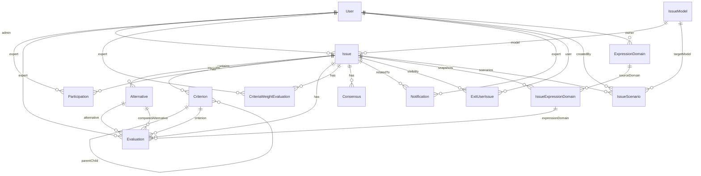

# Crete Valley DSS — Data Model

## Propósito

Este documento describe el modelo de datos actual del backend de **Crete Valley DSS** a nivel de persistencia MongoDB/Mongoose. Su objetivo es servir como referencia funcional y técnica para entender:

- qué colecciones existen,
- qué representa cada una,
- cómo se relacionan entre sí,
- qué campos son clave,
- y qué invariantes o reglas de dominio conviene tener presentes.

> Alcance: este documento describe **modelos de persistencia**. No sustituye la documentación OpenAPI de endpoints ni la documentación JSDoc de controladores, módulos o flows.

---

## Visión general

El centro del dominio es **Issue**, que representa un problema de decisión. Alrededor de él giran:

- la configuración del problema (`IssueModel`, `ExpressionDomain`, `IssueExpressionDomain`),
- la estructura del problema (`Alternative`, `Criterion`),
- la participación de usuarios (`Participation`, `ExitUserIssue`, `Notification`),
- la captura de evaluaciones y pesos (`Evaluation`, `CriteriaWeightEvaluation`),
- los artefactos derivados del proceso (`Consensus`, `IssueScenario`).

En términos funcionales:

- `User` representa usuarios y administradores.
- `IssueModel` representa un algoritmo o método de decisión disponible.
- `Issue` representa una ejecución concreta de un problema de decisión.
- `ExpressionDomain` representa dominios reutilizables.
- `IssueExpressionDomain` representa snapshots congelados de dominios dentro de un issue.

---

## Convenciones importantes del modelo

### 1. Separación entre definición reutilizable y snapshot

Hay una diferencia importante entre:

- `ExpressionDomain`: definición reutilizable y editable de un dominio.
- `IssueExpressionDomain`: copia congelada del dominio usada por un issue concreto.

Esto evita que cambios posteriores en un dominio reutilizable alteren evaluaciones ya existentes.

### 2. El issue guarda órdenes estables

El orden funcional de alternativas y criterios hoja no depende solo de sus colecciones individuales. El modelo `Issue` guarda explícitamente:

- `alternativeOrder`
- `leafCriteriaOrder`

Esto permite mantener un orden estable de visualización, cálculo y exportación.

### 3. La evaluación puede ser directa o pairwise

El issue y los modelos soportan dos estructuras de evaluación:

- `direct`
- `pairwiseAlternatives`

En modo pairwise, `Evaluation` utiliza también `comparedAlternative`.

### 4. Existen fechas funcionales y fechas técnicas

En varios modelos conviven dos tipos de fecha:

- **fechas de dominio**: por ejemplo `creationDate` o `closureDate` en `Issue`
- **fechas técnicas**: `createdAt` y `updatedAt` cuando el schema usa `timestamps`

### 5. Hay campos `Mixed` por necesidad de dominio

No todos los modelos pueden describirse con estructura rígida. Algunos usan `Schema.Types.Mixed` porque dependen del modelo matemático, del número de criterios o de la forma de entrada:

- `Issue.modelParameters`
- `Evaluation.value`
- `CriteriaWeightEvaluation.bestToOthers`
- `CriteriaWeightEvaluation.othersToWorst`
- `CriteriaWeightEvaluation.manualWeights`
- `IssueScenario.config`, `inputs` y `outputs`
- `Consensus.level` y `collectiveEvaluations`

---

## Mapa de relaciones

---

## Colecciones

## 1. User

**Colección / modelo:** `User`

### Propósito
Representa una cuenta del sistema. Puede ser un usuario estándar o un administrador.

### Campos clave
- `name`
- `university`
- `email` (único)
- `password` (hasheada)
- `role` (`user` | `admin`)
- `tokenConfirm`
- `emailTokenConfirm`
- `accountConfirm`
- `accountCreation`

### Relaciones
- Puede ser administrador de muchos `Issue`.
- Puede participar como experto en muchos `Participation`.
- Puede tener muchas `Evaluation`, `CriteriaWeightEvaluation`, `Notification`, `ExitUserIssue` e `IssueScenario`.
- Puede ser propietario de `ExpressionDomain` privados.

### Reglas e invariantes
- `email` debe ser único.
- La contraseña no se almacena en texto plano: se hashea en `pre("save")`.
- Expone un método `comparePassword` para autenticación.

---

## 2. IssueModel

**Colección / modelo:** `IssueModel`

### Propósito
Actúa como catálogo de métodos o algoritmos de decisión disponibles para crear issues.

### Campos clave
- `name`
- `isConsensus`
- `isMultiCriteria`
- `smallDescription`
- `extendDescription`
- `moreInfoUrl`
- `parameters`
- `evaluationStructure` (`direct` | `pairwiseAlternatives`)
- `supportedDomains`

### Relaciones
- Un `IssueModel` puede ser utilizado por muchos `Issue`.
- También puede ser utilizado como `targetModel` en `IssueScenario`.

### Reglas e invariantes
- `parameters` es un subschema declarativo.
- El campo `default` de cada parámetro se valida contra sus restricciones.
- `supportedDomains` describe qué tipos de dominio acepta el modelo.

---

## 3. Issue

**Colección / modelo:** `Issue`

### Propósito
Representa un problema de decisión concreto creado por un administrador.

### Campos clave
- `admin`
- `model`
- `name`
- `description`
- `isConsensus`
- `consensusMaxPhases`
- `consensusThreshold`
- `modelParameters`
- `currentStage`
- `weightingMode`
- `evaluationStructure`
- `active`
- `creationDate`
- `closureDate`
- `alternativeOrder`
- `leafCriteriaOrder`
- `createdAt`, `updatedAt`

### Relaciones
- Pertenece a un `User` administrador.
- Usa un `IssueModel`.
- Tiene `Alternative`, `Criterion`, `Participation`, `Evaluation`, `Consensus`, `IssueExpressionDomain`, `CriteriaWeightEvaluation`, `IssueScenario`, `Notification` y `ExitUserIssue` relacionados.

### Reglas e invariantes
- `currentStage` puede ser:
  - `criteriaWeighting`
  - `weightsFinished`
  - `alternativeEvaluation`
  - `finished`
- `weightingMode` puede ser:
  - `manual`
  - `consensus`
  - `bwm`
  - `consensusBwm`
  - `simulatedConsensusBwm`
- `evaluationStructure` puede ser:
  - `direct`
  - `pairwiseAlternatives`
- El hook `pre("remove")` elimina en cascada alternativas, criterios, evaluaciones, participaciones y consensos del issue.

### Observaciones
`Issue` es el agregado central del dominio.

---

## 4. Alternative

**Colección / modelo:** `Alternative`

### Propósito
Representa una alternativa evaluable dentro de un issue.

### Campos clave
- `issue`
- `name`

### Relaciones
- Pertenece a un `Issue`.
- Puede aparecer en `Evaluation` como `alternative` o `comparedAlternative`.

### Observaciones
El orden funcional de las alternativas no se guarda aquí, sino en `Issue.alternativeOrder`.

---

## 5. Criterion

**Colección / modelo:** `Criterion`

### Propósito
Representa un criterio del problema, pudiendo formar jerarquías en árbol.

### Campos clave
- `issue`
- `parentCriterion`
- `name`
- `type`
- `isLeaf`

### Relaciones
- Pertenece a un `Issue`.
- Puede referenciar a otro `Criterion` como padre.
- Puede aparecer en muchas `Evaluation`.

### Reglas e invariantes
- Los criterios pueden ser raíz o hijos.
- Los criterios hoja (`isLeaf = true`) son los que normalmente participan directamente en pesos y evaluaciones.

---

## 6. Participation

**Colección / modelo:** `Participation`

### Propósito
Representa la participación de un experto en un issue.

### Campos clave
- `issue`
- `expert`
- `invitationStatus`
- `evaluationCompleted`
- `weightsCompleted`
- `entryPhase`
- `entryStage`
- `joinedAt`
- `createdAt`, `updatedAt`

### Relaciones
- Pertenece a un `Issue`.
- Referencia a un `User` experto.

### Reglas e invariantes
- `invitationStatus` puede ser:
  - `pending`
  - `accepted`
  - `declined`
- Índice único por `issue + expert`.
- `entryStage` puede ser:
  - `criteriaWeighting`
  - `alternativeEvaluation`
  - `null`

### Observaciones
Este modelo captura tanto invitación como progreso del experto.

---

## 7. Evaluation

**Colección / modelo:** `Evaluation`

### Propósito
Representa una evaluación individual emitida por un experto sobre una alternativa y un criterio.

### Campos clave
- `issue`
- `expert`
- `alternative`
- `comparedAlternative`
- `criterion`
- `expressionDomain`
- `value`
- `timestamp`
- `consensusPhase`
- `history`

### Relaciones
- Pertenece a un `Issue`.
- Referencia a un `User` experto.
- Referencia a una `Alternative` principal.
- Puede referenciar una `Alternative` comparada.
- Referencia a un `Criterion`.
- Referencia a un `IssueExpressionDomain`.

### Reglas e invariantes
- En evaluación directa, `comparedAlternative` normalmente es `null`.
- En evaluación pairwise, `alternative` y `comparedAlternative` forman la pareja comparada.
- `history` conserva trazabilidad por fase.
- `consensusPhase` por defecto es `1`.

---

## 8. CriteriaWeightEvaluation

**Colección / modelo:** `CriteriaWeightEvaluation`

### Propósito
Almacena la evaluación de pesos de criterios realizada por un experto dentro de un issue.

### Campos clave
- `issue`
- `expert`
- `bestCriterion`
- `worstCriterion`
- `bestToOthers`
- `othersToWorst`
- `manualWeights`
- `consensusPhase`
- `completed`

### Relaciones
- Pertenece a un `Issue`.
- Referencia a un `User` experto.

### Reglas e invariantes
- Sirve tanto para BWM como para pesos manuales.
- Usa campos `Mixed` porque la forma de entrada depende del problema.
- `consensusPhase` por defecto es `1`.

---

## 9. Consensus

**Colección / modelo:** `Consensus`

### Propósito
Almacena información agregada de consenso para una fase de un issue.

### Campos clave
- `issue`
- `phase`
- `level`
- `timestamp`
- `details`
- `collectiveEvaluations`

### Relaciones
- Pertenece a un `Issue`.

### Observaciones
- `details` y `collectiveEvaluations` son flexibles porque dependen del algoritmo de consenso.
- Se usa para conservar el resultado agregado de una fase concreta.

---

## 10. ExpressionDomain

**Colección / modelo:** `ExpressionDomain`

### Propósito
Representa un dominio de expresión reutilizable, global o privado de un usuario.

### Campos clave
- `user`
- `name`
- `isGlobal`
- `locked`
- `type`
- `numericRange`
- `linguisticLabels`
- `createdAt`

### Relaciones
- Puede pertenecer a un `User` cuando es privado.
- Puede servir como origen de muchos `IssueExpressionDomain`.

### Reglas e invariantes
- `type` puede ser:
  - `numeric`
  - `linguistic`
- Los dominios privados tienen unicidad por `user + name`.
- Los dominios globales tienen unicidad por `isGlobal + name`.
- Las etiquetas lingüísticas usan un validador de arrays numéricos ordenados.

### Observaciones
`ExpressionDomain` es una plantilla reutilizable, no la referencia final usada por las evaluaciones del issue.

---

## 11. IssueExpressionDomain

**Colección / modelo:** `IssueExpressionDomain`

### Propósito
Representa un snapshot congelado de un dominio de expresión dentro de un issue.

### Campos clave
- `issue`
- `sourceDomain`
- `name`
- `type`
- `numericRange`
- `linguisticLabels`
- `createdAt`, `updatedAt`

### Relaciones
- Pertenece a un `Issue`.
- Puede referenciar un `ExpressionDomain` origen.
- Puede ser usado por muchas `Evaluation`.

### Reglas e invariantes
- Índice único por `issue + sourceDomain`.
- El snapshot mantiene una copia estable del dominio original.
- El cambio posterior del dominio origen no debe alterar el snapshot del issue.

---

## 12. Notification

**Colección / modelo:** `Notification`

### Propósito
Representa una notificación enviada a un experto.

### Campos clave
- `expert`
- `issue`
- `type`
- `message`
- `requiresAction`
- `actionTaken`
- `read`
- `createdAt`

### Relaciones
- Pertenece a un `User` experto.
- Puede estar asociada a un `Issue`.

### Reglas e invariantes
- `issue` puede ser `null`.
- `read` indica lectura.
- `requiresAction` y `actionTaken` permiten distinguir acciones pendientes de simples avisos.

---

## 13. ExitUserIssue

**Colección / modelo:** `ExitUserIssue`

### Propósito
Conserva el estado de salida u ocultación de un issue para un usuario, junto con su historial.

### Campos clave
- `issue`
- `user`
- `hidden`
- `timestamp`
- `phase`
- `stage`
- `reason`
- `history`
- `createdAt`, `updatedAt`

### Relaciones
- Pertenece a un `Issue`.
- Pertenece a un `User`.

### Reglas e invariantes
- Índice único por `user + issue`.
- `stage` puede ser:
  - `criteriaWeighting`
  - `alternativeEvaluation`
  - `null`
- `history.action` puede ser:
  - `entered`
  - `exited`

### Observaciones
Se usa para trazabilidad y para gestionar visibilidad/ocultación del issue por usuario.

---

## 14. IssueScenario

**Colección / modelo:** `IssueScenario`

### Propósito
Almacena escenarios calculados o simulados a partir de un issue.

### Campos clave
- `issue`
- `createdBy`
- `name`
- `targetModel`
- `targetModelName`
- `domainType`
- `evaluationStructure`
- `status`
- `error`
- `config`
- `inputs`
- `outputs`
- `createdAt`, `updatedAt`

### Relaciones
- Pertenece a un `Issue`.
- Referencia al `User` que lo creó.
- Referencia al `IssueModel` usado como modelo objetivo.

### Reglas e invariantes
- `domainType` puede ser:
  - `numeric`
  - `linguistic`
- `evaluationStructure` puede ser:
  - `direct`
  - `pairwiseAlternatives`
- `status` puede ser:
  - `running`
  - `done`
  - `error`
- Índice por `{ issue, createdAt: -1 }` para recuperar escenarios recientes.

### Observaciones
Es un artefacto derivado del issue, útil para simulación, cálculo alternativo, análisis comparativo o trazabilidad de ejecuciones.

---

## Relaciones clave resumidas

### Núcleo del dominio
- `Issue` -> `User` (admin)
- `Issue` -> `IssueModel`
- `Issue` -> `Alternative[]`
- `Issue` -> `Criterion[]`
- `Issue` -> `Participation[]`
- `Issue` -> `Evaluation[]`
- `Issue` -> `CriteriaWeightEvaluation[]`
- `Issue` -> `Consensus[]`
- `Issue` -> `IssueExpressionDomain[]`
- `Issue` -> `IssueScenario[]`
- `Issue` -> `Notification[]`
- `Issue` -> `ExitUserIssue[]`

### Configuración de evaluación
- `ExpressionDomain` -> `IssueExpressionDomain[]`
- `IssueExpressionDomain` -> `Evaluation[]`
- `IssueModel` -> `Issue[]`
- `IssueModel` -> `IssueScenario[]`

### Participación de usuarios
- `User` -> `Issue[]` como admin
- `User` -> `Participation[]` como experto
- `User` -> `Evaluation[]`
- `User` -> `CriteriaWeightEvaluation[]`
- `User` -> `Notification[]`
- `User` -> `ExitUserIssue[]`
- `User` -> `IssueScenario[]`
- `User` -> `ExpressionDomain[]` privados

---

## Invariantes de negocio importantes

1. **Un experto no debe tener dos participaciones en el mismo issue.**
   - Garantizado por índice único en `Participation`.

2. **Un usuario no debe tener dos registros de visibilidad/salida para el mismo issue.**
   - Garantizado por índice único en `ExitUserIssue`.

3. **Un snapshot de dominio no debe duplicarse para el mismo dominio origen dentro de un issue.**
   - Garantizado por índice único en `IssueExpressionDomain`.

4. **Los dominios de expresión globales y privados no deben colisionar de forma indebida.**
   - Resuelto con índices parciales en `ExpressionDomain`.

5. **Las evaluaciones deben usar snapshots de dominio del issue, no definiciones reutilizables directas.**
   - `Evaluation.expressionDomain` referencia `IssueExpressionDomain`.

6. **La eliminación de un issue implica borrado en cascada de dependencias principales.**
   - Implementado en el hook `pre("remove")` de `Issue`.

---

## Recomendaciones de mantenimiento

### Recomendado mantener
- JSDoc de cabecera en cada modelo.
- Índices documentados en el propio schema.
- Hooks ligados al lifecycle del modelo dentro del fichero del modelo.
- Helpers reutilizables fuera del schema cuando estén duplicados.

### Evitar
- Acoplar OpenAPI 1:1 al schema de Mongo.
- Mover hooks pequeños fuera del modelo solo por estética.
- Introducir más subcarpetas de las necesarias en `models/`.

---

## Resumen final

El modelo de datos de Crete Valley DSS está organizado alrededor de `Issue` como agregado principal. La estructura actual separa correctamente:

- catálogo de modelos (`IssueModel`),
- cuentas y roles (`User`),
- estructura del problema (`Alternative`, `Criterion`),
- dominios reutilizables y snapshots (`ExpressionDomain`, `IssueExpressionDomain`),
- participación y trazabilidad (`Participation`, `ExitUserIssue`, `Notification`),
- evaluaciones y pesos (`Evaluation`, `CriteriaWeightEvaluation`),
- artefactos derivados (`Consensus`, `IssueScenario`).
